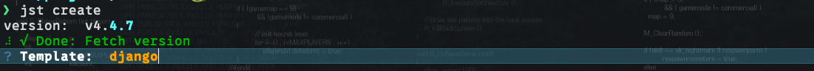

# jst-django docs

Assalomu Alaykum bu dasturni o’rganishdan avval bu dastur haqida biroz aytib bermoqchiman bu dastur nega kerak kimlar uchun shu haqida birlib olishingiz muhum.

bu dastur ikkita bo’lakga bo’lingan biri cli dastur ikkinchisi asosiy arxitiktura.

Cli dasturni barcha django loyihalarda ishlatishingiz mumkun u asosan fayillar yaratish uchun ishlatiladi imkoniyatlari yangi app yaratish va kerakli modullarni generatsiya qilish yani model,serializer,view,permission va boshqalar. 

Ikkinchisi arxitiktura unda loyiha productinga chiqgansa muammosiz ishlashi uchun ko’plab sozlamalar avvaldan sozlangan masalan docker compose, stack, swarm va ko’plab kerakli packagelar o’rnatilgan modeltranslation,silk,celery,websocket va shunga o’xshash ko’plab kutubxonalar bularni keyinroq to’liq tushuntirib beraman.

> Eslatma: bu ikki dastur birga ko’plab qulayliklar beradi lekin ularni alohida ham ishlatish mumkun. Birga ishlatish maslahat beriladi
> 

### Atamalar

| module | module bu model,serializer,view,translation,test,admin,filters,permissions |
| --- | --- |
|  |  |
|  |  |

# O’rnatish

cli dasturni pip yordamida o’rnatishingiz mumkun

```python
pip install -U jst-django
```

> Eslatma: template (arxitiktura) va clini birga ishlatayotganda har doim cli oxirigi verisyada ekanligiga ishoch hosil qiling
> 

# Bo’limlar

1. Loyiha yaratish
2. Yangi app yaratish
3. Module generatsiya qilish

# Yangi loyiha yaratish

```python
jst create
```

birinchi bo’lib template so’raydi bu men yuqorida aytgan template arxitiktura jstni ikkinchi bo’lagi default holatda django qoldiring



va keyin sizdan project name so’raladi bu loyiha nomi bunga etiborliroq bo’ling chunki loyiha ichida yaratiladigan fayillarda shu nom ishlatiladi


Settings file buni default holatda qoldiring va enterni bosing


jstni eng foydali imkoniyatlaridan biri jst avtomatik siz uchun kerakli kutubxonalarni sozlab beradi siz shunchaki sizga nimalar kerak ekanligini belgilashingiz kerak

> Eslatma: modeltranslation va parler ikkalasi ham tarjima uchun shuning uchun undan faqat bittasini tanglang odatiy holatda modeltranslations maslahat beraman parlerni imkoniyatlarini loyihangiz ehtiyojlariga qarab tanlashingiz mumkun parler haqida o’z saytidan o’qib olasiz
> 

> 😀 Kulguli eslatma: space bossangiz tanlanadi va barchasini tanlab bo’lgandan keyin enter bosing
> 


wsgi yoki asgi loyihangiz qanday vazifa bajaritishga qarab o’zingiz tanlaysiz async loyiha bo’lsa asgi tanlang masalan websocket uchun lekin bunday bo’lmasa wsgi ni tanlang


`Script file:` default qoldiring. 

`Django key:` bu loyiha uchun muhum foydalanuvchi parollari shu yordamida shifrlanadi localda key ishlatishingiz mumkun lekin prodda o’zingiz yarating.

`Port:` bu loyiha ishga tushadigan port o’zingizga qulay portni yozishingiz mumkun.

`Admin password:` jst sizga avtomatik admin user yaratib beradi siz buning uchun unga parol va telefron no’mer berishingiz kerak. Eslatma: telefon no’mer va parolni default qoldirmang

`Flake8:` bu loyihada ishlaydigan barchada birxil qoidalar bilan ko’d yozishga majburlaydi


Vanihoyat uzoq qiynoqli so’rovlardan keyin bizda loyiha yaratildi 


Endi qilinishi kerak bo’lgan oxirgi ish loyihani ishga tushurish

> Eslatma: yuqorida aytilganday loyiha ishlashi uchun kompyuteringizda `Docker` bo’lishi kerak. Hazillashdim yuqorida docker kerak demagan edim yo’q bo’lsa endi o’rnating 🤣
> 

loyiha joylashgan papkaga kiring va `make up` comandasini kiring make siz uchun loyihani to’liq sozlab beradi agarda sizda make mavjud bo’lmasa o’rnatib olishingiz yoki `docker compose up -d` , `docker compose exec web python3 [manage.py](http://manage.py) seed` comandalaridan foydalanishingiz mumkun. Make o’rnatib olishni tavsiya qilaman bu keyinchalik ishni tezlashtiradi


bo’ldi ishga tushdi qo’rqmang loyiha yaratish uchun boshqa ish qolmadi endi shuncha qilingan ishlar o’zini oqlaydi shekili 😁. Kutmadan tezroq `8081` portga kiring nimani kutyapsiz. Testlarni ishga tushirib ko’rish ham esingizdan chiqmasin `make test`

# Yangi app yaratish

yangi app yaratish huddi django startapp kabi faqat ko’proq imkoniyatlar bilan

```python
jst make:app <app_name>
```

sizdan module tanlashni so’raydi

1. default: agar sizga default holatda hechqanday tayyor narsa kerak bo’lmasa default tanlang
2. bot: app vazifasi telegram bot yaratish bo’lsa bu modulni tanlang 
3. authbot: telegram bot yordamida authorizatsiya
4. authv2: Authorization yangi versiyasi o’rnatib ko’rib imkoniyatlarini ko’rishingiz mumkun
5. websocket: websocket bila ishlash uchun

> Eslatma: qaysini tanlashni bilmasangiz default ni tanlang
> 

tanlashingiz bilan app yaratiladi va apps listga qo’shiladi


# Module yaratish

Siz bilan module yaratishda yangiliklar saytini qilib ko’raylik etibor bering haligacha loyihani editor yordamida ochmadik birinchi apiyimizni ham editorsiz yaratamiz

```python
jst make:module
```

bu command jst cli ning eng foydali va eng ko’p ishlatiladigan commandasi 

sizdan birinchi bo’lib file name so’raydi bu modul qaysi fayilda bo’lishi, jstda odatiy django kabi ko’dlar bitta fayilda yozilmaydi masalan [admin.py](http://admin.py) [views.py](http://views.py) … emas admin/*.py views/*.py. siz kiritgan fayil name bilan barcha papkada fayil yaratiladi masalan `post` endi barcha module ichida `admin/post.py` `views/post.py` yaratiladi


File namedan so’ng sizdan name so’raydi bu qanday nomdagi modullar kerak ekanligi masalan post uchun bizga nimalar kerak buni model nomlari deb hisoblashingiz ham mumkun masalan. Bizga `post, tag, category` kerak kiritamiz

> Eslatma: barcha nomalr kiritilgandan keyin Esc tugmasini bosing va enter
> 


keyin sizdan bu modullar qaysi app ichida yaratish kerak ekanligini so’raydi o’zingizga kerakli appni tanlang


keyingi bosqich sizdan nimalar kerakligini yani model,serializer vahokozo `barchasini tanlang`


Va barchasi tayyor biz yozgan barcha modul namelar bo’yicha apilar yaratilgan masalan `api/post, api/tag, api/category` bularni barchasida default holatda name field mavjud keyingi bosqichda biz bularni sozlashni ko’rib chiqamiz hozir ham test qilib ko’rishingiz mumkun shunchaki avval migratsiyalarni ishga tushuring `make makemigrate`

# Template

Endi navbat jst templatega standart djangodagi kabi minimal emas lekin barcha fayillarni o’z vazifasi bor.

```python
├── config # barcha config fayillar
│   ├── __init__.py
│   ├── asgi.py
│   ├── celery.py
│   ├── conf # qo'shimcha o'rnatilgan kutubxona configlar ishu papkada alohida fayil sifatida yoziladi
│   │   ├── __init__.py
│   │   ├── apps.py # INSTALL_APPS avjud
│   │   ├── cache.py
│   │   ├── celery.py
│   │   ├── channels.py
│   │   ├── ckeditor.py
│   │   ├── cron.py
│   │   ├── jwt.py
│   │   ├── logs.py
│   │   ├── modules.py # jst yordamida yartilgan applar INSTALL_APPS da emas shu fayildagi MODULES o'zgaruvchisiga kiritiladi
│   │   ├── navigation.py # django unfold admin panelda chiqishi kerak bo'lgan model
│   │   ├── rest_framework.py
│   │   ├── spectacular.py
│   │   ├── storage.py
│   │   └── unfold.py
│   ├── env.py
│   ├── settings # Sozlamalar
│   │   ├── __init__.py
│   │   ├── common.py # Asosiy sozlamamlar
│   │   ├── local.py # Faqat localda ishlashi kerak bo'lgan sozlamalar
│   │   ├── production.py # Productionda ishlashi kerak bo'lgan sozlamalr
│   │   └── test.py # make test qilinganda ishlatiladigan sozlamale
│   ├── urls.py
│   └── wsgi.py
├── core # Loyiha
│   ├── __init__.py
│   ├── apps # barcha applar
│   │   ├── __init__.py
│   │   ├── accounts # Default accounts app authorization tayyor
│   │   │   ├── __init__.py
│   │   │   ├── admin
│   │   │   ├── apps.py
│   │   │   ├── choices
│   │   │   ├── managers
│   │   │   ├── migrations
│   │   │   ├── models
│   │   │   ├── seeder
│   │   │   ├── serializers
│   │   │   ├── signals
│   │   │   ├── tasks
│   │   │   │   ├── __init__.py
│   │   │   │   └── sms.py
│   │   │   ├── urls.py
│   │   │   └── views
│   │   ├── logs
│   │   └── shared
│   ├── services # Umumiy servicelar uchun
│   │   ├── __init__.py
│   │   ├── otp.py
│   │   ├── sms.py
│   │   └── user.py
│   └── utils
│       ├── __init__.py
│       ├── cache.py
│       ├── console.py
│       ├── core.py
│       └── storage.py
├── docker # Docker fayiller
│   ├── Dockerfile.nginx
│   └── Dockerfile.web
├── docker-compose.prod.yml 
├── docker-compose.test.yml
├── docker-compose.yml
├── Jenkinsfile
├── jst.json # jst config json
├── k8s # Kubernetes
├── Makefile
├── manage.py
├── pyproject.toml
├── README.MD
├── requirements.txt
├── resources
│   ├── layout
│   │   ├── Dockerfile.alpine
│   │   ├── Dockerfile.nginx
│   │   ├── mypy.ini
│   │   └── nginx.conf
│   ├── logs
│   ├── media
│   └── scripts
│       ├── backup.sh
│       ├── entrypoint-server.sh
│       └── entrypoint.sh
└── stack.yaml # loyihani deploy qilish uchun swarm yordamida
```
